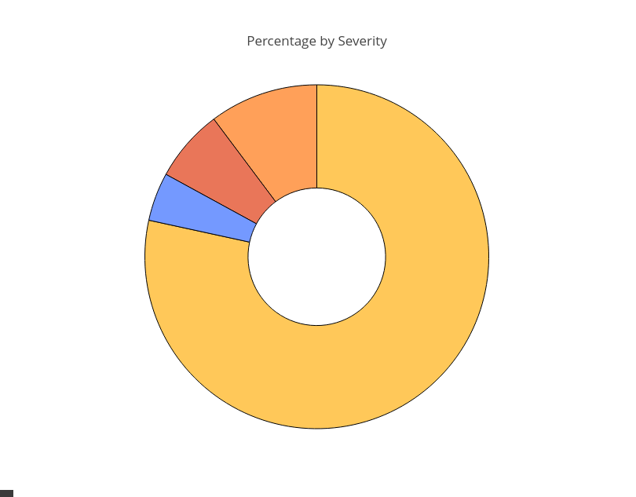

Script to generate an "at-a-glance" pie chart of any errors that may have occurred on a Zabbix instance.

Using either "Daily" or "Weekly" as the argument;
it requests from the zabbix api, historical data into a Pandas Dataframe.

The dataframe is then cleaned by formatting the column types and dropping any unnecessary columns not used.

Using Plotly it then translates that data into a visual pie chart and saves locally to "test.html" file.

My use case for this was to have an at-a-glance, visual representation of any issues that occurred at any of the DataCenters.

